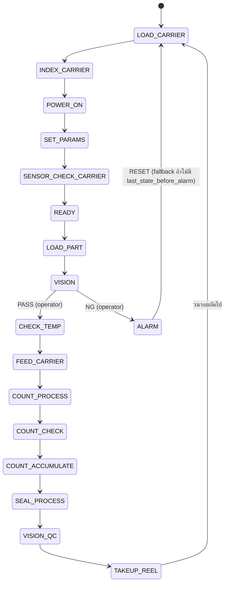
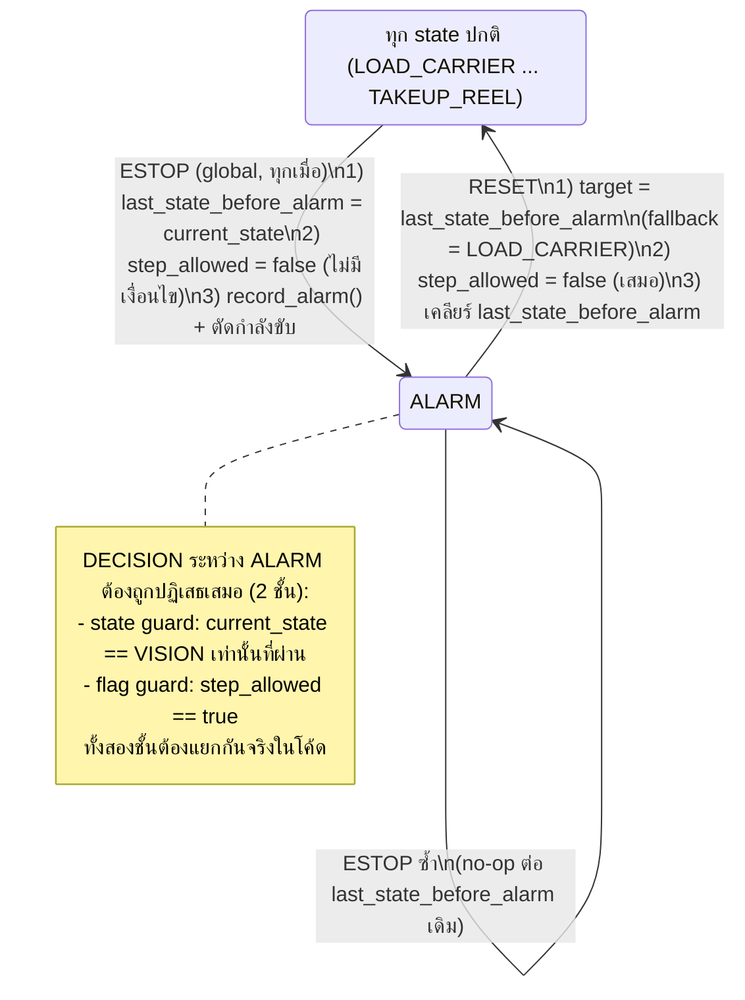

# FSM Specification — เครื่อง taping SMD reel

> `backend` / `stm32` / `testing` อ่านอย่างเดียว
> ไฟล์ที่โค้ดต้องตรงเป๊ะคือ [`state_table.csv`](state_table.csv) ไฟล์นี้คือคำอธิบาย
> สถานะ: 🔶 ร่างจากโค้ดที่รันอยู่จริง (`python_backend/gateway_fsm.py` บรรทัด 30–35)

---

## 1. สถานะปัจจุบัน 17 states

ชื่อ state ในไฟล์นี้ตรงกับ `STATES` ใน `gateway_fsm.py` ทุกตัวอักษร
**ห้ามพิมพ์ชื่อ state เป็นสตริงลอย ๆ ในโค้ดฝั่งใดฝั่งหนึ่ง** ให้อ้างจากตารางนี้เสมอ



> **ESTOP ไม่ได้วาดในไดอะแกรมนี้เพราะเป็น global transition** (เข้าได้จากทุก state ไม่ใช่แค่ตามลูกศรข้างบน)
> ดูไดอะแกรมแยกที่ [หัวข้อ 6](#6-alarm--e-stop-recovery-safety-critical) — ต้องอ่านคู่กัน ห้ามอ่านแค่รูปนี้รูปเดียวแล้วสรุปว่า ALARM เข้าได้ทางเดียว

---

## 2. จุดที่ต้องระวัง (บทเรียนจากบั๊กจริง)

### 2.1 `VISION` เป็น operator gate — ห้ามทอยผลซ้ำในลูป
FSM ต้อง **หยุดรอ** คนกด PASS/NG จริง ๆ ตั้ง `step_allowed = true` แล้วรอ

> บั๊กเดิม: เช็ค `step_allowed == True` ในลูป 20 ms → ทอยความน่าจะเป็นใหม่ทุกรอบ
> เด้ง ALARM ~78% ภายใน 2 วินาที กด PASS แทบไม่ทัน
> แก้: ทอยครั้งเดียวตอนกล้องตรวจเสร็จ

### 2.2 `ALARM` ต้องจำสเต็ปที่ค้าง
ตอนเข้า ALARM ต้องเซฟ `last_state_before_alarm` ไม่งั้นกด RESET แล้วเด้งกลับผิดสเต็ป
(ของเดิมไม่จำ → เด้งกลับไปสเต็ปค้างของ alarm ครั้งก่อนหน้า)
รายละเอียดครบ (รวมเคส ESTOP กลาง VISION) → [หัวข้อ 6](#6-alarm--e-stop-recovery-safety-critical)

### 2.3 `RESET` ต้องเคลียร์ `step_allowed`
ไม่งั้นค้างเป็น `true` ข้ามรอบ แล้วรอบถัดไปจะข้ามการรอ operator
**บั๊กจริงที่ยืนยันแล้ว** (`docs/test-reports/2026-08-04-new-coverage.md`): ESTOP กดตอนค้างที่ `VISION`
ไม่เคลียร์ `step_allowed` → `DECISION` ที่มาทีหลัง (รวมถึงที่กล้อง OpenMV ยิงเองอัตโนมัติตอน
`PRESENCE_SENSOR_MODE=True`) หลุดออกจาก ALARM ได้โดยไม่มีคนกด RESET เลย ขัด `machine_spec.md` ข้อ 6
ดูข้อกำหนดเต็มที่ [หัวข้อ 6](#6-alarm--e-stop-recovery-safety-critical) — **ห้าม implement เอาเองจากบรรทัดนี้บรรทัดเดียว**

### 2.4 `DECISION` ตอน FSM ไม่ได้รออยู่ → ต้องปฏิเสธ
ห้ามให้คำสั่งจากภายนอกกระโดดสเต็ปได้ ตอบกลับด้วย `DECISION_ACK` ที่ `accepted: false`

### 2.5 logic การตัดสินต้องมีที่เดียว
`apply_decision()` ใช้ร่วมกันทั้งฝั่ง WebSocket (เว็บ) และฝั่ง TCP (จอ)
ห้ามเขียนแยกสองที่ เพราะจะแก้บั๊กได้แค่ฝั่งเดียวแล้วไม่รู้ตัว

---

## 3. ประเด็นค้าง — `fsm` ต้องตัดสินใจแล้วแก้ให้เรียบร้อย

โค้ดที่รันอยู่ตอนนี้ **ไม่ใช่ FSM จริง** แต่เป็น **ring ที่เดินไปข้างหน้าเรื่อย ๆ**
(`STATES[(idx + 1) % len(STATES)]`) — ยังไม่มี transition table จริง ผลคือ:

| # | ประเด็น | ทำไมถึงเป็นปัญหา |
|---|---|---|
| 1 | `ALARM` อยู่ในลิสต์ ring ด้วย (index 16) | ถ้าเดินมาถึงตามลำดับปกติ จะเข้า ALARM เองโดยไม่มีอะไรผิด |
| 2 | `POWER_ON` / `SET_PARAMS` อยู่กลางรอบ (index 2, 3) | ตามหลักควรอยู่ก่อน `READY` และทำครั้งเดียวตอนเปิดเครื่อง ไม่ใช่ทุกรอบ |
| 3 | `COUNT_CHECK` ยังไม่มีทางแยกจริง | ควรแยกเป็น "ครบ → STOP" / "ไม่ครบ → วนกลับ" แต่ตอนนี้เดินตรงต่อไป |
| 4 | ชื่อ state `SET_PARAMS` ชนกับชื่อ action `SET_PARAMS` ใน `protocol.md` | สับสนเวลาอ่าน log ควรเปลี่ยนชื่ออันใดอันหนึ่ง |
| 5 | ไม่มี `STOP` / `INIT` ทั้งที่ FSM ต้นแบบของพี่เลี้ยงมี | ต้นแบบใช้ INIT/READY/INDEX/CHECK_INDEX/… คนละชุดชื่อกับที่ implement |
| 6 | guard ส่วนใหญ่ยังไม่ผูกกับสัญญาณจริง | ต้องรอ I/O List จาก `machine_spec.md` |

> **การเปลี่ยนชื่อหรือลำดับ state คือ breaking change** กระทบ `backend` + `stm32` + `frontend` + `testing`
> ต้องแจ้งเซสชันให้สั่งแก้พร้อมกันทุกฝั่ง อย่าแก้ CSV แล้วปล่อยโค้ดไว้

---

## 4. เทียบกับ FSM ต้นแบบของพี่เลี้ยง

ต้นแบบอยู่ที่ [`fsm_source_mentor.md`](fsm_source_mentor.md) — เรียบง่ายกว่ามาก (13 states):
`INIT → READY → INDEX → CHECK_INDEX → LOAD_PART → VISION → FEED_COVER → CHECK_TEMP → SEAL → SEAL_CHECK → ROLL → COUNT_CHECK → STOP` + `ALARM`

**ยังไม่ได้ตัดสินใจว่าจะยึดชุดไหน** — เป็นงานที่ `fsm` ต้องเสนอทางเลือกให้ user ตัดสิน:
- ยึดชื่อของพี่เลี้ยง (ส่งงานง่าย ตรงกับเอกสารที่พี่เลี้ยงเขียนไว้) แต่ต้องแก้โค้ด 3 ฝั่ง
- ยึดชื่อที่ implement แล้ว (ไม่ต้องแก้โค้ด) แต่ต้องอธิบายส่วนต่างตอนส่ง

---

## 5. ที่ต้องทำต่อ (`fsm`)

- [ ] เสนอทางเลือกเรื่องชุดชื่อ state ให้ user ตัดสิน (ข้อ 4)
- [ ] เอา `ALARM` ออกจาก ring แล้วทำเป็น transition จริง
- [ ] ทำทางแยกของ `COUNT_CHECK` ให้วนกลับ/จบรอบตาม `target_pieces`
- [ ] ผูก guard เข้ากับ I/O List จริงหลัง `machine-design` ออก `machine_spec.md`
- [ ] เติมคอลัมน์ `guard` ใน CSV ให้ครบทุกแถว
- [x] **2026-08-05** นิยาม ESTOP/ALARM/RESET latch behavior เป็นทางการ (บั๊ก safety จาก
      `docs/test-reports/2026-08-04-new-coverage.md`) → ดู [หัวข้อ 6](#6-alarm--e-stop-recovery-safety-critical)
      **`backend` ต้อง implement ตามหัวข้อ 6 เป๊ะ** ใน `gateway_fsm.py` + `gateway_fsm_upgrad.py`

---

## 6. ALARM & E-STOP Recovery (Safety-Critical)

> เขียนขึ้นเพื่อปิดบั๊กจริงที่ `testing` ยืนยันแล้วใน `docs/test-reports/2026-08-04-new-coverage.md`:
> E-STOP กดตอนค้างที่ `VISION` (ซึ่ง `step_allowed=true` อยู่แล้วเพราะเป็น operator gate) ไม่เคลียร์ธง
> → `DECISION` ที่มาทีหลัง (แม้เป็นช่วง ALARM รวมถึงที่กล้อง OpenMV ยิงเองอัตโนมัติตอน
> `PRESENCE_SENSOR_MODE=True`) หลุดออกจาก ALARM ได้โดยไม่มีคนกด RESET เลย
> ขัด `machine_spec.md` ข้อ 6 ("E-STOP กด → ตัดกำลังขับทันที เข้า ALARM" ห้ามละเมิด)
>
> **หัวข้อนี้คือสเปกที่ต้อง implement เป๊ะ ไม่ใช่แนวทางคร่าว ๆ ให้ `backend` เดาต่อ**

### 6.1 ตัวแปรที่เกี่ยวข้อง

| ชื่อ | ชนิด | ความหมาย | อยู่ที่ไหนแล้ว |
|---|---|---|---|
| `step_allowed` | bool | FSM กำลังรอ operator ตัดสินอยู่ไหม (ตั้ง `true` ตอนเข้า `VISION`) | มีอยู่แล้ว — `protocol.md` ข้อ 2, `state_table.csv` แถว `VISION` |
| `last_state_before_alarm` | string (state name) | state ที่ค้างอยู่ตอนก่อนเข้า `ALARM` — ใช้เป็นเป้าหมายตอน `RESET` | ต้องมีเป็น field ระดับ FSM (ไม่ใช่ local ในฟังก์ชันเดียว) — มีร่างไว้แล้วใน `state_table.csv` แถว `ALARM` (คอลัมน์ notes) |
| `current_state` | string (state name) | state ปัจจุบันของ FSM | มีอยู่แล้ว |
| action `ESTOP` | protocol action | คำสั่งที่มีอยู่แล้วทั้งทาง TCP และ WS ตาม `protocol.md` ข้อ 4 | มีอยู่แล้วใน `gateway_fsm.py` (ตามที่ `machine_spec.md` ข้อ 6 อ้างถึง) |
| action `RESET` | protocol action | คำสั่งที่มีอยู่แล้วทั้งทาง TCP และ WS ตาม `protocol.md` ข้อ 4 | มีอยู่แล้วใน `gateway_fsm.py` |

**สัญญาณฮาร์ดแวร์จริงของปุ่ม E-STOP** ยังไม่มีชื่อใน `machine_spec.md` ข้อ 4 (I/O List ยังเป็น
`_ยังไม่มีข้อมูล_` ทั้งตาราง) — **ห้ามคิดชื่อสัญญาณเอง** ตอนนี้ guard ใช้ระดับ **protocol action `ESTOP`**
(ซอฟต์แวร์) เท่านั้น ถ้า `machine-design` เติม I/O List แล้วมีสัญญาณ E-STOP จริงจากฮาร์ดแวร์
(เช่น NC contact ต่อ DI) ให้ `fsm` กลับมาผูก guard เพิ่มอีกชั้นจากสัญญาณนั้นทีหลัง — ยังไม่ blocked
งานนี้เพราะ action `ESTOP` ที่มีอยู่แล้วเพียงพอสำหรับปิดบั๊กที่พบ

### 6.2 พฤติกรรม `ESTOP` (global action — เข้าได้จากทุก state)

`ESTOP` ไม่ใช่ transition ปกติที่ผูกกับ guard ของแถวใดแถวหนึ่งใน `state_table.csv` — เป็น
**global override** ที่ยิงได้จากทุก state ปัจจุบัน (ใช้ next_state_ng=`ALARM` ที่มีอยู่แล้วทุกแถว
เป็นเป้าหมาย แต่ไม่ผ่านการเช็ค guard ของแถวนั้นเลย ตัด flow ปกติทันที) ลำดับที่ต้องทำเมื่อรับ `ESTOP`:

1. **ถ้า `current_state != ALARM` ในขณะนั้น:** `last_state_before_alarm = current_state` (จำสเต็ปที่ค้าง)
2. **ถ้า `current_state == ALARM` อยู่แล้ว** (กด ESTOP ซ้ำระหว่าง ALARM): **ห้ามทับ** `last_state_before_alarm`
   เดิม — เป็น no-op สำหรับตัวแปรนี้ ป้องกันไม่ให้ RESET เด้งไปที่ `ALARM` เอง
3. **เคลียร์ `step_allowed = false` ทันที ไม่มีเงื่อนไข** — นี่คือจุดที่บั๊กเดิมพลาด ต้องทำเสมอไม่ว่า
   state ก่อนหน้าจะเป็นอะไร (โดยเฉพาะ `VISION` ที่ `step_allowed` เป็น `true` อยู่แล้วตามปกติ)
4. `current_state = ALARM`
5. รัน `entry_action` ของ `ALARM` ตาม `state_table.csv` (`record_alarm()`)
6. ตัดกำลังขับ (ตาม `machine_spec.md` ข้อ 6 — เป็นงานของ `backend`/`stm32` ฝั่ง actuator ไม่ใช่ FSM logic
   แต่ต้องเกิด "ทันที" ในลำดับเดียวกับ step 1-5 ไม่ใช่ค่อยตามมาทีหลัง)

### 6.3 การรับ `DECISION` ระหว่าง ALARM — ต้อง block 2 ชั้น (defense in depth)

**ต้องปฏิเสธ `DECISION` เสมอระหว่างอยู่ใน `ALARM`ไม่ว่า `step_allowed` จะมีค่าอะไรก็ตาม** ตอบกลับ
`DECISION_ACK` ที่ `accepted: false` (ตาม `fsm_spec.md` ข้อ 2.4 เดิม)

ให้ implement เป็น **2 เงื่อนไขอิสระที่ต้องผ่านทั้งคู่** ไม่ใช่เช็คแค่ตัวเดียว:

- **ชั้นที่ 1 — state guard:** `current_state == VISION` เท่านั้นที่รับ `DECISION` ได้ (state อื่นทุกตัว
  รวม `ALARM` ปฏิเสธเสมอ โดยไม่ต้องดู `step_allowed` เลยด้วยซ้ำ)
- **ชั้นที่ 2 — flag guard:** `step_allowed == true`

`accept_decision := (current_state == VISION) AND (step_allowed == true)`

เหตุผลที่ต้อง 2 ชั้นแทนที่จะพอแค่ชั้นเดียว: บั๊กที่เจอจริงคือชั้น flag (`step_allowed`) ค้าง `true`
ข้าม ALARM มา ถ้าโค้ดพึ่งชั้น flag อย่างเดียว บั๊กแบบเดิมจะกลับมาได้อีกจากจุดอื่นที่ลืมเคลียร์
`step_allowed` เช่นกัน แต่ถ้ามีชั้น state guard (`current_state == VISION`) กันไว้อีกชั้น ต่อให้
`step_allowed` หลุดค้าง `true` ระหว่าง `ALARM` ระบบก็ยังปฏิเสธ `DECISION` อยู่ดี เพราะ
`current_state` ตอนนั้นคือ `ALARM` ไม่ใช่ `VISION` — **ทั้งสองชั้นต้องเขียนแยกกันจริงในโค้ด ห้ามลด
เหลือชั้นเดียวเพราะ "เช็คซ้ำ"**

### 6.4 พฤติกรรม `RESET` — **สองกิ่งตามสถานะ** logic เดียว ใช้ร่วมกันทั้ง TCP และ WS

> ⚠️ **แก้ 2026-08-05 (รอบสอง)** — เดิมข้อนี้ระบุว่า `RESET` ใช้ปลด ALARM ได้อย่างเดียว
> **กิ่ง ALARM (ข้อ 6.4.1) ยังยืนตามเดิมทุกตัวอักษร ห้ามแตะ** — ที่เพิ่มเข้ามาคือ **กิ่งที่ 2 (ข้อ 6.4.2)**
> สำหรับตอนที่ **ไม่ได้อยู่ใน ALARM** เท่านั้น เหตุผลและหลักฐานอยู่ที่ข้อ 6.4.5

**บั๊กจริงที่พบ:** ทาง TCP วิ่งเข้า "FULL RESET" (ล้าง counter กลับ `LOAD_CARRIER` เสมอ) ส่วนทาง WS
วิ่งเข้า "RESUME EXACT STEP" (กลับไป `last_state_before_alarm` จริง) — **สองพฤติกรรมนี้ห้ามอยู่คู่กัน
ในสถานะเดียวกัน** ขัดกับ `fsm_spec.md` ข้อ 2.5 ("logic การตัดสินต้องมีที่เดียว") และขัด `protocol.md`
ข้อ 4 ที่ระบุไว้แล้วว่า `RESET` คือ "ออกจาก ALARM กลับ state ที่ค้าง + เคลียร์ `step_allowed`"

**นิยามเดียวที่ถูกต้อง — ทั้ง TCP และ WS ต้องเรียกฟังก์ชันเดียวกัน** (ตามแนวทาง `apply_decision()`
ที่ใช้ร่วมกันอยู่แล้วตามข้อ 2.5) ฟังก์ชันนั้นแตกเป็น **2 กิ่งที่แยกกันขาดด้วย `current_state == ALARM`**
— **กิ่งเดียวเท่านั้นที่ทำงานต่อ 1 ครั้งที่กดปุ่ม ห้ามไหลจากกิ่งหนึ่งไปอีกกิ่งเด็ดขาด**

#### 6.4.1 กิ่งที่ 1 — `current_state == ALARM` (ปลด ALARM) 🔴 safety-critical ห้ามแก้

กิ่งนี้คือสเปกเดิมที่ปิดบั๊ก safety ไปแล้วเมื่อ 2026-08-05 (`test_estop.py` 26/27 ทั้งสอง gateway)
**ห้ามเปลี่ยนแม้แต่ขั้นตอนเดียว** — ใช้ได้เฉพาะตอน `current_state == ALARM` เท่านั้น เมื่อรับแล้ว:

1. `target = last_state_before_alarm` **ถ้ามีค่า** — ถ้าไม่เคยตั้งค่าเลย (เช่น ALARM เกิดตอนบูตก่อนมี
   state ที่ถูกต้อง) ให้ fallback เป็น `LOAD_CARRIER` (จุดเริ่มตามที่ระบุไว้ใน `state_table.csv` แถว 0)
2. `step_allowed = false` **เสมอ ไม่มีเงื่อนไข** — ห้ามข้ามแม้ target จะเป็น state ที่ปกติไม่ใช้
   `step_allowed` เพราะเป้าหมายคือ "ไม่ให้ค้างข้ามรอบ" ไม่ใช่ "เซ็ตให้ตรงกับ state ปลายทาง"
3. `current_state = target`
4. `last_state_before_alarm = null` (เคลียร์หลังใช้ ป้องกันค่าเก่าเล็ดลอดไปใช้ผิดรอบถัดไป)

**กิ่งนี้ห้ามแตะ counter เด็ดขาด** — `pieces_count` / `cycles` ต้องคงค่าเดิมข้าม ALARM ทุกครั้ง
(ปลด alarm แล้วต้องทำงานต่อจากที่ค้าง ไม่ใช่เริ่มนับใหม่)

#### 6.4.2 กิ่งที่ 2 — `current_state != ALARM` (เริ่ม batch ใหม่) — เพิ่มใหม่ 2026-08-05

**เงื่อนไขที่ต้องผ่านครบทั้ง 2 ข้อ** (เขียนแยกกันจริงในโค้ด ห้ามยุบเหลือข้อเดียว ตามแนวเดียวกับข้อ 6.3):

```
branch2_allowed := (current_state != ALARM) AND (running == false)
```

- **ข้อ 1 — `current_state != ALARM`** 🔴 **นี่คือเส้นแบ่ง safety** ดูข้อ 6.4.3
- **ข้อ 2 — `running == false`** (คีย์ `running` มีอยู่แล้วใน `protocol.md` ข้อ 2 และข้อ 3 ทั้งสองช่องทาง)
  แปลว่า operator **กด STOP มาก่อนแล้ว** หรือ **batch จบเองแล้ว** (backend ตั้ง `running=false`
  ให้อัตโนมัติตอน `pieces_count >= target_pieces`) — ถ้าเครื่องกำลังเดินอยู่ **ให้ปฏิเสธ** ตามข้อ 6.4.4

**ถ้าผ่านทั้งสองข้อ ให้ทำครบทุกข้อนี้ — รายการนี้ครบถ้วนแล้ว `backend` ไม่ต้องเดาเพิ่มสักตัว:**

| # | ตัวแปร | ค่าใหม่ | เหตุผล |
|---|---|---|---|
| 1 | `pieces_count` | `0` | ยอดของ batch เก่า ต้องไม่ปนกับ batch ใหม่ |
| 2 | `cycles` | `0` | ตัวนับรอบของ batch เก่า เหตุผลเดียวกัน |
| 3 | `camera1_count` | `0` | คู่เทียบของ `COUNT_CHECK` — ถ้าไม่ล้างคู่กัน guard `count < target_pieces` จะเทียบข้าม batch |
| 4 | `encoder_count` | `0` | เหตุผลเดียวกับข้อ 3 **ต้องล้างพร้อมกันเสมอ ห้ามล้างตัวเดียว** |
| 5 | `step_allowed` | `false` | **ไม่มีเงื่อนไข** — กฎเดียวกับกิ่งที่ 1 ข้อ 2 ห้ามให้ธงค้างข้าม batch |
| 6 | `last_state_before_alarm` | `null` | ค่าค้างจาก alarm รอบเก่าต้องไม่เล็ดลอดข้าม batch ไปใช้ผิด |
| 7 | `current_state` | `LOAD_CARRIER` | ต้นรอบตาม `state_table.csv` แถว 0 — **ค่าตายตัว ไม่ใช่ fallback** ต่างจากกิ่งที่ 1 |
| 8 | `running` | **คงเป็น `false`** | 🔴 **ห้าม auto-start** — `RESET` ไม่ใช่ `START` operator ต้องกด START เองอีกครั้ง |
| 9 | `predictive_warning` | `""` | ล้างข้อความค้างของ batch เก่า (เช่นข้อความ batch-done ที่บล็อก `START` ทาง WS อยู่) |

**สิ่งที่กิ่งที่ 2 ห้ามแตะเด็ดขาด:**

- `target_pieces`, `pitch`, `current_temp`, `mode`, `speed_mul`, `machine_params` — เป็น **ค่าตั้งเครื่อง
  ไม่ใช่สถานะ batch** operator ตั้งไว้แล้วต้องคงอยู่ ไม่งั้นกด RESET ทีต้องไปตั้งค่าใหม่ทุกครั้ง
- **ประวัติใน SQL และ alarm ledger** — มีคำสั่ง one-shot แยกอยู่แล้ว (`CLEAR_SQL_HISTORY`,
  `CLEAR_ALARM_LOGS` ตาม `protocol.md` ข้อ 4) **ห้าม `RESET` ไปล้างให้**
- **ห้ามเรียก `record_alarm()`** — การเริ่ม batch ใหม่ไม่ใช่ alarm ไม่ต้องมีแถวใน ledger
- `ip0`/`ip1`/`op0`/`op1` — ปล่อยให้ลูปหลักขับตามปกติ (ไม่ได้อยู่ใน ALARM อยู่แล้ว)

#### 6.4.3 🔴 ยืนยัน: กิ่งที่ 2 เข้าถึงไม่ได้เลยขณะอยู่ใน `ALARM`

**นี่คือข้อที่ห้ามพลาด** ถ้ากิ่งที่ 2 ทำงานได้ตอนอยู่ใน ALARM มันจะกลายเป็น **ช่องปลด ALARM ทางอ้อม**
(ตั้ง `current_state = LOAD_CARRIER` = ออกจาก ALARM โดยไม่ผ่านลำดับของกิ่งที่ 1) ซึ่งคือ**บั๊ก safety
ตัวเดียวกับที่เพิ่งปิดไป** ต้องกันด้วย 2 ชั้นพร้อมกัน:

- **ชั้นที่ 1 — ลำดับ:** เช็ค `current_state == ALARM` **ก่อนเป็นอันดับแรกสุด** แล้ว **return ทันที**
  เมื่อกิ่งที่ 1 ทำงานจบ ห้ามให้โค้ดไหลต่อลงไปถึงกิ่งที่ 2 ในการกดครั้งเดียวกัน
- **ชั้นที่ 2 — guard ของตัวเอง:** กิ่งที่ 2 ต้องมีเงื่อนไข `current_state != ALARM` เขียนอยู่ในตัวมันเอง
  ต่อให้ชั้นลำดับพังหรือถูก refactor ผิด กิ่งที่ 2 ก็ยังไม่ทำงานใน ALARM

> **ผลที่ต้องเป็นจริงเสมอ:** กด `RESET` ตอนอยู่ใน `ALARM` แล้ว `pieces_count` และ `cycles`
> **ต้องมีค่าเท่าเดิมทุกครั้ง** — ถ้าเห็นเป็น 0 หลังปลด alarm แปลว่ากิ่งที่ 2 รั่วเข้าไปทำงาน = บั๊ก safety
> `testing` ใช้ข้อนี้เป็น assertion ได้ตรง ๆ

**ทั้งสองกิ่งต้องอยู่ในฟังก์ชันเดียวกันที่ทั้ง TCP (จอ) และ WS (เว็บ) เรียกร่วมกัน** ตามข้อ 2.5
ห้ามให้ช่องทางใดช่องทางหนึ่งมีกิ่งที่ 2 แต่อีกช่องทางไม่มี — บั๊กเดิมที่ปิดไปเกิดจากสองช่องทางทำไม่เหมือนกัน

#### 6.4.4 ตารางผลลัพธ์ + ข้อกำหนดการ log

**ทุกครั้งที่รับ `RESET` ต้องมี log 1 บรรทัดเสมอ ห้าม ignore เงียบ** และบรรทัดนั้นต้องบอกได้ 2 อย่าง:
**(ก) เข้ากิ่งไหน (ข) มาจากช่องทางไหน** — เพราะปัญหาที่ทำให้ต้องแก้ข้อนี้คือ "กด 48 ครั้ง ถูกปฏิเสธ 44
ครั้ง โดยไม่มีใครรู้ว่าทำไม" ถ้า log ไม่แยกกิ่ง เราจะกลับไปไล่ปัญหาเดิมไม่ได้อีก

| `current_state` | `running` | ผล | โทเคนที่ต้องมีใน log |
|---|---|---|---|
| `ALARM` | อะไรก็ได้ | กิ่งที่ 1 — ปลด alarm กลับ `last_state_before_alarm` · counter **คงเดิม** | `RESET/ALARM-CLEAR` |
| ไม่ใช่ `ALARM` | `false` | กิ่งที่ 2 — เริ่ม batch ใหม่ กลับ `LOAD_CARRIER` · counter **= 0** | `RESET/NEW-BATCH` |
| ไม่ใช่ `ALARM` | `true` | **ปฏิเสธ** ไม่เปลี่ยนอะไรสักตัว | `RESET/IGNORED-RUNNING` |

- โทเคนทั้งสามต้องเป็น **สตริงคงที่ ค้นหาได้ตรง ๆ** ใน log ห้ามเปลี่ยนถ้อยคำตามช่องทาง
- ต่อท้ายด้วย tag ช่องทางที่มีอยู่แล้ว (`TOUCHGFX RESET` สำหรับ TCP / `RESET` สำหรับ WS) เพื่อให้รู้ว่า
  ปุ่มบนจอหรือปุ่มบนเว็บเป็นคนยิง
- แถว `IGNORED-RUNNING` ต้องเขียนเหตุผลให้คนอ่านเข้าใจด้วย เช่น "กด STOP ก่อนถึงจะเริ่ม batch ใหม่ได้"
  ไม่ใช่แค่บอกว่าถูก ignore
- กิ่งที่ 1 และ 2 ต้องคืนค่าให้ผู้เรียกรู้ว่าทำงานสำเร็จหรือถูกปฏิเสธ (แบบเดียวกับที่ `apply_reset()`
  คืน `True`/`False` อยู่แล้ว) เพื่อให้ชั้นบนเอาไปทำ ACK ต่อได้ในอนาคตโดยไม่ต้องแก้ logic ซ้ำ

#### 6.4.5 เหตุผลของการตัดสินใจ (ทำไมเป็นแบบนี้ ไม่ใช่แบบอื่น)

**ทำไมต้องมีกิ่งที่ 2 เลย — ไม่ใช่แค่เรื่องความสะดวก แต่เป็นทางตันจริง**

จอ TouchGFX มีปุ่ม `RESET` **ปุ่มเดียวที่ยิง `{"action":"RESET"}` ตายตัว** และ **ไม่มีปุ่ม "เริ่ม batch ใหม่"**
ในทั้ง 6 ปุ่มที่มี (START / STOP / RESET / PASS / NG / ตั้งค่า target-pitch) ⇒ เมื่อ batch จบ
(`pieces_count >= target_pieces`) แล้ว **ไม่มีทางใด ๆ ที่ operator จะเริ่ม batch ใหม่ได้จากจอเลย**
ต้องรีสตาร์ต gateway สถานเดียว · วัดจาก log จริง: กด `RESET` 48 ครั้ง **ถูกปฏิเสธเงียบ 44 ครั้ง**
คนกดสรุปว่า "เครื่องค้าง" — ปุ่มที่ไม่ตอบสนองอะไรเลยแย่กว่าปุ่มที่ทำงานผิด เพราะไม่มีข้อมูลให้แก้ต่อ

**ทำไมเลือกเงื่อนไข `running == false` (เห็นด้วยกับข้อเสนอของเซสชัน)**

1. **กันความเสียหายที่กู้คืนไม่ได้** — ถ้าล้าง counter ตอนเครื่องกำลังเดิน ยอดที่หายไปเอากลับมาไม่ได้
   และที่สำคัญกว่า **เทปที่เดินไปแล้วกับชิ้นงานที่ซีลไปแล้วมันย้อนกลับไม่ได้** ⇒ `pieces_count` จะ
   เพี้ยนจากของจริงบนม้วนทันที ซึ่งอันตรายกว่าการกดแล้วไม่ทำงานมาก
2. **ครอบคลุมเคสทางตันครบ** — จุดที่ operator ต้องการเริ่ม batch ใหม่จริง ๆ มี 2 จุด และ**ทั้งสองจุด
   `running` เป็น `false` อยู่แล้วโดยธรรมชาติ**: (ก) batch จบเอง — backend ตั้ง `running=false` ให้เอง
   (ข) operator กด STOP กลางคันเพื่อเลิกรอบ (เปลี่ยนวัตถุดิบ/เลิกงาน) ⇒ เงื่อนไขนี้**ไม่ได้ปิดเคสที่ต้องใช้จริง
   สักเคส** แต่ปิดเฉพาะเคสที่กดพลาด
3. **อธิบายให้ operator เข้าใจได้ด้วยประโยคเดียว** — "กด STOP ก่อน แล้วค่อยกด RESET" เป็นกฎที่จำได้
   และเป็นลำดับที่คนใช้เครื่องทำอยู่แล้วโดยสัญชาตญาณ

**ทางเลือกที่พิจารณาแล้วไม่เอา** (เขียนไว้กันคนหลังมารื้อซ้ำ):

| ทางเลือก | ทำไมไม่เอา |
|---|---|
| ไม่มีเงื่อนไขเลย กดเมื่อไรก็ล้าง | กดพลาดตอนเครื่องเดิน = counter หายกลางคัน กู้ไม่ได้ ตรงกับข้อ 1 ข้างบน |
| บังคับ `pieces_count >= target_pieces` (เริ่มใหม่ได้เฉพาะตอน batch จบ) | แคบเกินไป — เคส "STOP กลางคันเพราะเปลี่ยนวัตถุดิบ" ซึ่งเจอบ่อยพอ ๆ กัน จะยังตันเหมือนเดิม และเงื่อนไขนี้มองไม่เห็นจากปุ่ม RESET บนจอ คนกดเดาไม่ถูกว่าทำไมบางทีได้บางทีไม่ได้ |
| บังคับ `current_state == READY` | หลังกด STOP กลางรอบ FSM ยังเดินจนจบรอบก่อนถึงจะไป `READY` ⇒ มีช่วงที่กด RESET แล้วยังไม่ทำงาน = กลับไปเป็นปัญหา "กดแล้วเงียบ" เดิม · `running == false` ให้เจตนาเดียวกันโดยไม่มี race เรื่องจังหวะ |
| กด RESET 2 ครั้งใน N วินาที (double-press) | ต้องมี timer state ที่ไม่มีใน `protocol.md` · ตรวจจาก log ย้อนหลังไม่ได้ · จอไม่มี feedback บอกว่าตอนนี้อยู่ในช่วงรอครั้งที่สอง |
| เพิ่ม action ใหม่ใน `protocol.md` | ต้องแก้ firmware + `protocol.md` + กระทบ 3 ฝั่งพร้อมกัน และ `.gitignore` ที่บัง `firmware/Appli/TouchGFX/target/` ยังค้างรออนุมัติ ⇒ **เซสชันตัดสินแล้วว่าไม่เอาทางนี้** สเปกนี้จึงทำภายใต้ action เดิม |

**ส่วนของสเปกเดิมที่ถูกแทนที่ และส่วนที่ยังยืนอยู่**

- ❌ **ถูกแทนที่:** ข้อความเดิมที่ว่า "ถ้าต้องการ full-reset ต้องเป็น action คนละชื่อ ห้ามทับ `RESET`"
  — เหตุผลตอนนั้นถูกต้องในแง่ความชัดเจนของ protocol แต่**ตั้งอยู่บนสมมติฐานว่าจอเพิ่มปุ่มใหม่ได้**
  ซึ่งไม่จริงในฮาร์ดแวร์ที่มีอยู่ (ดูย่อหน้าแรกของข้อนี้)
- ✅ **ยังยืนทุกข้อ:** (1) กิ่งที่ 1 ทั้งหมดในข้อ 6.4.1 (2) `RESET` **ห้ามเป็นทางลัดออกจาก ALARM
  โดยไม่ผ่านลำดับของกิ่งที่ 1** (ข้อ 6.4.3) (3) logic ต้องมีที่เดียวใช้ร่วมทั้ง TCP/WS (ข้อ 2.5)
- 📌 **`protocol.md` ต้องอัปเดตตาม** — แถว `RESET` ในข้อ 4 ตอนนี้เขียนแค่ "ออกจาก ALARM กลับ state
  ที่ค้าง + เคลียร์ `step_allowed`" ซึ่งอธิบายกิ่งที่ 1 อย่างเดียว **`fsm` ไม่ใช่เจ้าของไฟล์นั้น จึงแก้เองไม่ได้**
  → เป็นคำขอถึง `integration` ผ่าน `docs/worklog/2026-08-05-fsm-reset.md` **ไม่มีคีย์ JSON หรือ action
  ใหม่เกิดขึ้นจากงานนี้เลย** เปลี่ยนแค่คำอธิบายพฤติกรรมของ action เดิม

**เรื่องสัญญาณฮาร์ดแวร์:** กิ่งที่ 2 **ไม่ได้สั่งให้เครื่องเริ่มเดิน** (ข้อ 8 ในตาราง 6.4.2 — `running`
คงเป็น `false`) จึงยังไม่ใช่ "การเริ่มรอบใหม่" ในความหมายของ `machine_spec.md` ข้อ 6.4 ⇒ **ไม่ต้องผูก
guard กับ `GUARD_NC`** ที่ข้อนั้นกำหนดไว้ · interlock ของ `GUARD_NC` ("guard เปิด → ห้ามเริ่มรอบใหม่")
เป็นของ action `START` ซึ่งเป็นคนละงานและยังไม่ได้ทำ — **`fsm` จดไว้ตรงนี้เพื่อไม่ให้ใครเข้าใจผิดว่า
งานนี้ปิดข้อนั้นไปแล้ว**

### 6.5 สรุปไดอะแกรม



### 6.6 สิ่งที่ `backend` ต้องทำต่อ (ไม่ใช่งานของ `fsm`)

ไฟล์ที่ต้องแก้ (ตาม `docs/worklog/2026-08-04-backend.md` งานค้างอยู่ที่ไฟล์เดียวกันนี้พอดี):

- `python_backend/gateway_fsm.py`
- `python_backend/gateway_fsm_upgrad.py`

งานที่ต้องทำ (ต้องทำเหมือนกันทั้งสองไฟล์ — ทั้งคู่มีบั๊กเดียวกันตาม test report):

1. handler ของ `ESTOP` ต้อง implement ตามข้อ 6.2 ครบทั้ง 5-6 ขั้นตอน (โดยเฉพาะเคลียร์ `step_allowed`)
2. `apply_decision()` (จุดเดียวที่ TCP/WS เรียกร่วมกันอยู่แล้วตามข้อ 2.5) ต้องเช็คตามข้อ 6.3 ครบ 2 ชั้น
3. รวม handler ของ `RESET` ทาง TCP กับ WS ให้เรียกฟังก์ชันเดียวกัน implement ตามข้อ 6.4 —
   **ห้ามมี path ที่ทำ "FULL RESET" หลงเหลืออยู่ในคำสั่ง `RESET`**
4. ส่งกลับให้ `testing` รันซ้ำ `test_estop.py` ทั้งสอง gateway (มีสคริปต์อยู่แล้ว
   `python_backend/tests/test_estop.py`) ยืนยัน 3 ข้อที่ 🔴 ใน
   `docs/test-reports/2026-08-04-new-coverage.md` กลับมาเป็น ✅ ครบ
